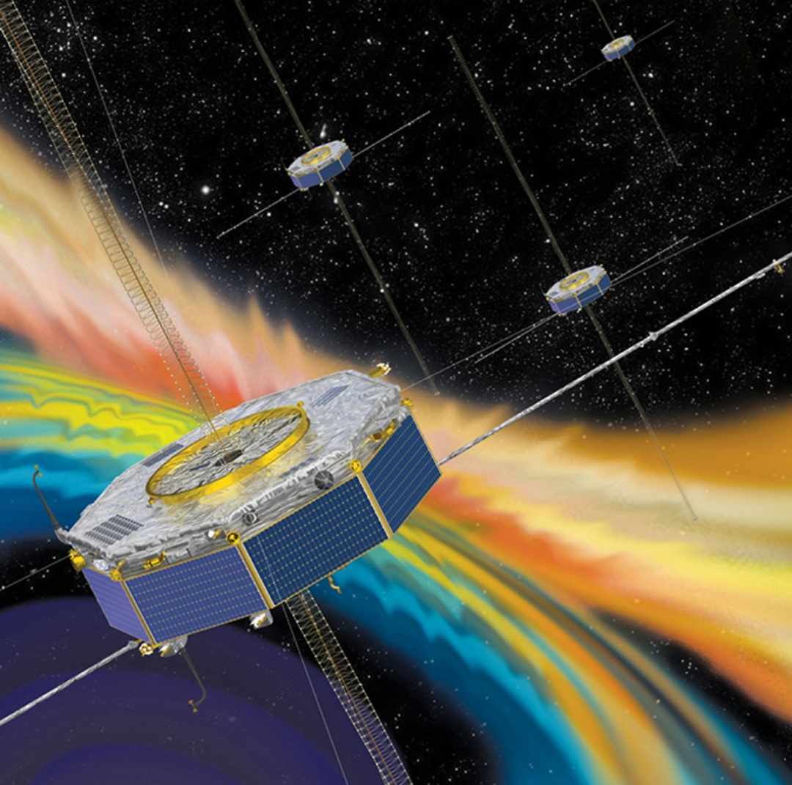

# NASA MMS Patching Story

NASA’s Magnetospheric Multiscale (MMS) spacecraft are part of a robotic space mission
that studies the Earth's magnetosphere. Launched in March 2015, MMS consists of four
identical spacecraft that fly in a tetrahedral formation. The spacecraft gather
information about the microphysics of magnetic reconnection including turbulence and
energetic particle acceleration —processes common in many astrophysical plasmas.

On July 27, 2015, NASA reported an error in one of the spacecraft, known as MMS-1: the
navigation solutions were blank! Without a navigation solution neither MMS-1, nor its
operators on Earth, had an accurate sense of its position in relation to the rest of the
constellation. This unexpected problem could compromise the mission.
The MMS operators discovered (nontrivially) that the algorithm responsible for producing
navigation solutions was trapped in an infinite loop. This algorithm solved Kepler’s
equation

> M = E – e sin E

to determine the spacecraft’s orbit from GPS data. In Kepler’s equation, `M` is the
mean anomaly, a fraction of an elliptical orbit’s period; `E` is the eccentric anomaly, an
angular parameter anomaly. It defines the angular position along a fictitious proxy orbit,
which is circular and has the radius equal to the semi-major axis of the true orbit; and
`e` is the eccentricity, a measure of how much the orbit deviates from a perfect circle.

The algorithm to solve Kepler’s equation requires a numerical method in a loop. MMS'
implementation of this algorithm had a stringent convergence tolerance; the code
would only exit this loop if the estimated error fell within this tolerance. The loop’s
algorithm can be summarized as

  1. guess a solution `E_0` and compared `M_0` to `M`
  2. compute the difference `M_0 – M` to produce an improved solution `E_1`
  3. repeat this process `k` times until `M_k – M < tol`.

MMS-1 got stuck trying to achieve `tol = epsilon`. With this algorithm malfunction, the
spacecraft had no way of knowing its location and maintaining the formation with the
other three MMS spacecrafts.

Although the process reset cleared the problem, the NASA Engineers decided to patch
the Flight Software (FSW) for safety. Instead of rewriting and recompiling the source
code, an-house development called Goddard Enhanced Onboard Navigation System was used.
They uploaded a patch that peeked into the memory location storing `tol` and poked a new value.

This approach required writing the new “tol” value to the non-volatile, Electrically
Erasable Programmable Read-Only memory (EEPROM); it required verifying the
EEPROM's data integrity, writing the new value to two locations in the EEPROM and a
new EEPROM checksum; and it required commanding a software re-load via a
Watchdog reset. Finally, the software was reloaded from the EEPROM into the active
RAM, and the team verified that the RAM-based cyclical redundancy checks (CRCs)
were correct and that no other faults were detected. Creative engineering and a
bit of luck solved the problem. Over 5 years later, MMS continues to produce high
quality scientific data. 

NASA/TM–20210018141

